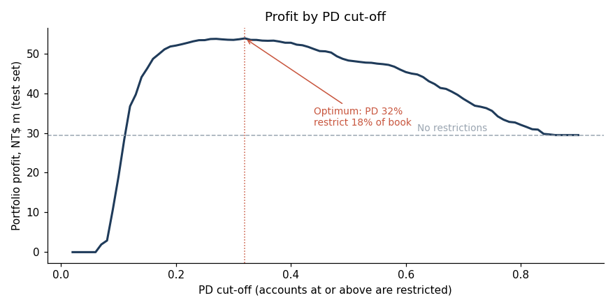
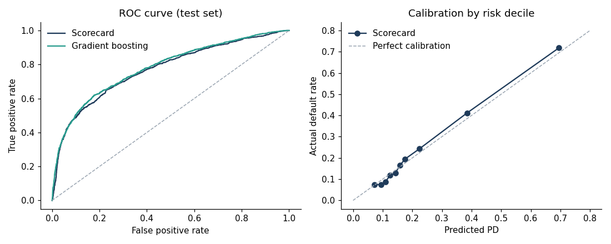

# Credit Card PD Model and Limit-Management Policy

A probability of default (PD) scorecard for a credit card book, and a cut-off policy that decides which accounts should have their limits restricted.

**Question:** which accounts should a card issuer restrict to cut losses without giving up too much income, and where should the cut-off sit?

## Result

| | Accounts restricted | Defaults caught | Portfolio profit (test set) |
|---|---|---|---|
| No action | 0% | 0% | NT$29.5m |
| Model-based policy (PD ≥ 32%) | 18% | 48% | NT$53.8m |

Restricting the riskiest 18% of accounts catches about half of all defaults and raises profit on the test portfolio by **NT$24m (+82%)**. The optimal cut-off sits close to the break-even PD derived from the assumptions (about 29%). Profit stays near its peak for cut-offs between roughly 20% and 45%, so the bank can choose within that range to match its risk appetite.



## Model performance (test set, 7,200 accounts)

| Model | AUC | Gini | KS |
|---|---|---|---|
| WoE logistic scorecard | 0.770 | 0.540 | 0.422 |
| Gradient boosting (benchmark) | 0.781 | 0.562 | 0.442 |

The scorecard gets within about two Gini points of the machine-learning benchmark while staying fully explainable. Its predicted PDs match actual default rates across risk deciles, and train and test performance are almost the same, so there is no sign of overfitting.



## Method

1. **Features.** Behavioural variables built from six months of history: worst delinquency, latest payment status, number of months late, utilisation, payment ratio, credit limit and last payment. Sex, marital status and age were left out on purpose because they are protected characteristics.
2. **Selection.** Features were binned, given Weight-of-Evidence values, and kept when their Information Value was 0.10 or higher (7 of 9 kept).
3. **Model.** Logistic regression on the WoE features, converted to a points-based score (600 points = 50:1 odds, +20 points doubles the odds).
4. **Validation.** AUC, Gini and KS on a stratified 30% holdout, a calibration check by decile, and a gradient boosting benchmark.
5. **Provisioning.** Expected loss backtested against realised loss, and accounts mapped to simplified IFRS 9 stages.
6. **Decision.** Expected profit for every PD cut-off, using stated assumptions (EAD = current balance, LGD = 75%, a good customer is worth about 30% of balance over its lifetime), plus a sensitivity test for LGD between 50% and 90%.

| LGD | Break-even PD | Best cut-off | Accounts restricted | Profit uplift |
|---|---|---|---|---|
| 50% | 37.5% | 37% | 16% | NT$13.6m |
| 65% | 31.6% | 32% | 18% | NT$20.0m |
| 75% | 28.6% | 32% | 18% | NT$24.3m |
| 90% | 25.0% | 26% | 22% | NT$31.0m |

The recommendation (restrict roughly the riskiest fifth of the book) holds across the whole range.

### Operating policy

| Band | Share of book | Default rate | Share of defaults | Action |
|---|---|---|---|---|
| Low (PD < 10%) | 18% | 7% | 6% | Keep; eligible for limit increase |
| Medium (10–30%) | 62% | 16% | 44% | Monitor; no limit increases |
| High (PD ≥ 30%) | 19% | 57% | 50% | Freeze or reduce limit |

### Scorecard points and reason codes

The model is also delivered as a points table (`figures/scorecard_points.csv`): each feature bin earns fixed points that add up to the score. The same table produces reason codes, the features that cost a customer the most points. For the riskiest test account (PD 85%, score 436), these were latest payment status, worst delinquency in six months and size of last payment.

### Expected loss and IFRS 9 staging

Expected loss per account = PD × LGD × EAD.

| Risk band | Expected loss (NT$m) | Actual loss (NT$m) | Predicted / actual |
|---|---|---|---|
| Low | 5.2 | 3.5 | 1.49 |
| Medium | 22.5 | 21.6 | 1.04 |
| High | 31.0 | 32.7 | 0.95 |
| **Total** | **58.7** | **57.9** | **1.01** |

At portfolio level, predicted loss is within about 1% of realised loss. The model overstates loss in the low-risk band, which is the conservative direction.

Mapping latest repayment status to simplified IFRS 9 stages (30+ days past due to Stage 2, 90+ to Stage 3):

| Stage | Share of book | Average PD | Actual default rate | Share of expected loss |
|---|---|---|---|---|
| Stage 1 (performing) | 78% | 15% | 14% | 49% |
| Stage 2 (30+ dpd) | 20% | 44% | 49% | 44% |
| Stage 3 (90+ dpd) | 2% | 81% | 67% | 7% |

A fifth of the book sits in Stage 2 but carries 44% of expected loss, which is where monitoring effort should go.

## Limitations

- The target is default in the next month. A Basel or IFRS 9 PD uses a 12-month horizon, so these PDs would need rescaling before being used for capital or provisioning.
- The data is from Taiwan in 2005, during a card-debt crisis, so the 22% default rate is far above a normal book. The method carries over, but the cut-off would need re-fitting on current data.
- Customer value and LGD are assumptions, not bank data; the sensitivity table covers a reasonable range.
- Validation is in-time only. A production model would also need an out-of-time test and population stability (PSI) monitoring.

## Repository

```
pd_model.ipynb        full analysis with outputs
src/scorecard.py      WoE encoder, Information Value, Gini/KS, score scaling
data/credit_default.csv
figures/              charts and scorecard_points.csv
```

Run it with `pip install -r requirements.txt`, then open `pd_model.ipynb`.

## Data

Yeh, I. C. and Lien, C. H. (2009), *The comparisons of data mining techniques for the predictive accuracy of probability of default of credit card clients*, Expert Systems with Applications. UCI Machine Learning Repository, "Default of Credit Card Clients". This project uses the 24,000-row version distributed with PyCaret.
